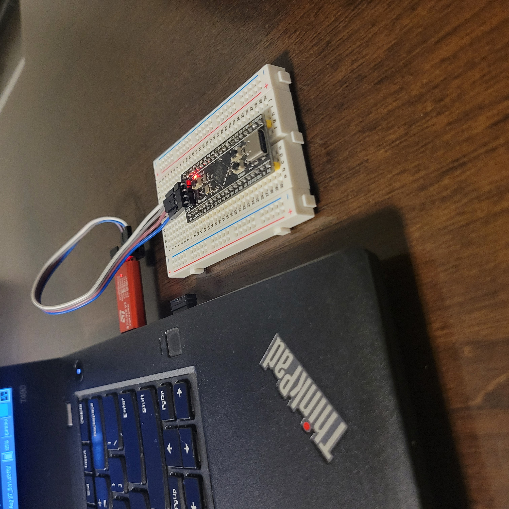

# semihosting-demo

Minimal "hello world" demo using semihosting to communicate with the host computer during a debug session

## Background

### What is semihosting?

Semihosting is a technique that allows embedded devices to communicate with the with host computer (e.g. print debug information to the host console). This technique requires the establishment of an active debugging session — code running on the embedded target (e.g. the microcontroller) communicates with the host or development machine through a hardware debugger (e.g. ST-Link). There is some overhead introduced to implement semihosting and it is not the best for time-critical tasks, thus it is mainly used for development and is usually disabled in production code. [^1][^2] 

## Required hardware set-up

```
Dev machine (host): Lenovo T480 running Arch Linux
Development board (target): WeAct Studio STM32F411CEU6 BlackPill v3.1
HW debugger: ST-Link V2 
```



*Black Pill development board with STM32 MCU connected to ST-Link V2 hardware debugger via SWD (serial wire debug) interface.*

SWD is a two-wire protocol used for debugging ARM-based microcontrollers.  In the picture above, there are (4) wires connecting the microcontroller to the debugger; technically only two of these wires are used for communication (SDIO and SWCLK), the other two wires (GND and VCC), are used to establish ground and to power the target device from the debugger or to inform the debugger of the target devices voltage levels.[^3]

## Configuration

The following configuration files are required:
- `.cargo/config.toml`
- `memory.x`

## Usage

1. Connect the HW debugger to the development board through the SW interface and to the development machine's USB port.
- Refer to [HW debugger set-up](#hw-debugger-set-up).

2. Open a new terminal and run this command: 
```
openocd -f interface/stlink.cfg -f target/stm32f4x.cfg
```

3.  This should run a custom runner as defined in .cargo/config.toml
```
runner = "arm-none-eabi-gdb -q -x openocd.gdb"
```

## Useful commands (if TCP port is blocked):

`sudo lsof -i :<PORT>`
- Lists open files assoiated with the specified port.

`sudo kill -9 <PID>`
- Terminates the process with the specified PID


[^1]: Source Name. *Title of the Source*. Retrieved from https://example.com
[^2]: Source Name. *Title of the Source*. Retrieved from https://example.com
[^3]: Source Name. *Title of the Source*. Retrieved from https://example.com
